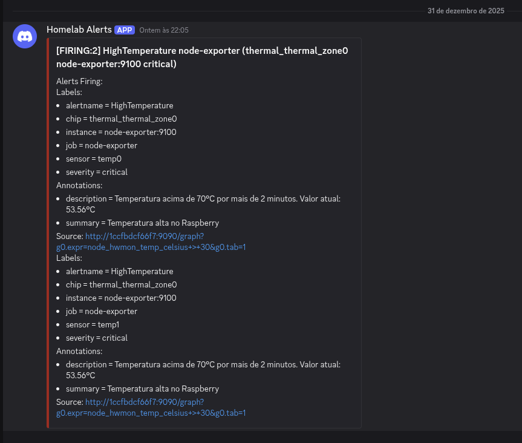

# Serviço de monitoramento do Homelab com Prometheus, Grafana e Alertmanager (via Discord)

<div align="center">

</div>

Este projeto configura um stack de monitoramento completo para um Raspberry Pi (ou outro host Linux) usando:

- **Node Exporter** – exporta métricas do sistema (CPU, memória, disco, temperatura…)
- **Prometheus** – coleta e armazena as métricas e avalia regras de alerta
- **Alertmanager** – gerencia e envia os alertas
- **Grafana** – dashboards e visualização
- **Discord** – canal de notificação de alertas

Tudo roda em **containers Docker**, orquestrados por um único `docker-compose.yml`.

---

## Objetivo

Ter um “painel de controle” profissional do homelab, com:

- histórico de métricas (CPU, RAM, disco, temperatura, etc.);
- alertas automáticos (por exemplo, temperatura alta) enviados para um canal do **Discord**;
- dashboards bonitos e fáceis de acessar via Grafana.

---

## Stack

- **Raspberry Pi 4** (ou servidor Linux) rodando Docker
- **Containers:**
  - `node-exporter`
  - `prometheus`
  - `alertmanager`
  - `grafana`

---

## Estrutura de diretórios

Dentro de `~/docker/big_brother`:

```text
big_brother/
├─ docker-compose.yml
├─ prometheus/
│  ├─ prometheus.yml
│  └─ alerts.yml
├─ alertmanager/
│  └─ alertmanager.yml
└─ grafana/
   └─ (dados em volume docker)
```
   
   # Como subir o stack

### Pré-requisitos
Certifique-se de ter instalado **Docker** e **Docker Compose**.

### Passo a passo

1. Vá para a pasta do projeto:
   ```bash
   cd ~/docker/big_brother
   ``` 
# Como subir o stack

## Instale Docker e Docker Compose

## Subir os serviços

1. Vá para a pasta do projeto:
    ```bash
    cd ~/docker/big_brother
    ```

2. Suba os serviços:
    ```bash
    docker compose up -d
    ```

3. Verifique se tudo está rodando:
    ```bash
    docker compose ps
    ```

## Acesso aos serviços

Assumindo que o host tem IP `IP_DO_HOST`:

- **Prometheus**: http://IP_DO_HOST9090
- **Grafana**: http://IP_DO_HOST:3000
- **Alertmanager**: http://IP_DO_HOST:9093
- **Node Exporter** (métricas cruas): http://IP_DO_HOST:9100/metrics

# Configurando o Grafana

## Acesso e Login
1. Acesse: http://IP_DO_HOST:3000
2. Login inicial:
   - **usuário**: admin
   - **senha**: admin *(trocar após o primeiro login)*

## Configurar Data Source
1. Vá para: **Connections → Data sources → Add data source → Prometheus**
2. Configure:
   - **URL**: http://prometheus:9090
3. Clique em **Save & test**

## Importar Dashboard
1. Vá para: **Dashboards → New → Import**
2. Insira o ID: **1860** (Node Exporter Full)
3. Selecione o data source **Prometheus**
4. Clique em **Import**

---

# Alertas e integração com o Discord

## Criar o webhook:

No servidor que irá utilizar: 

Configurações -> Integrações -> Webhooks -> Novo Webhook -> Copie a url

## Por que usar `discord_configs` em vez de `webhook_configs` ou `/slack`?

Durante a configuração dos alertas para o Discord,  eu tentei utilizar tanto a
- `webhook_configs` com a URL do Discord
quanto a
- `slack_configs` com a URL do Discord terminando em `/slack`

Mas, porém, contudo, entretanto, todavia, o Alertmanager estava funcionando corretamente, mas o Discord retornava erros HTTP 400, como:
```bash
    {"message": "Cannot send an empty message", "code": 50006}
    {"attachments": ["0"]}
``` 

Esses erros indicam que o payload JSON que o Alertmanager envia nesses modos **não é compatível** com o formato esperado pelo Discord, que exige campos como `content` ou `embeds` em um formato específico.

Com isso, mesmo com o alerta `HighTemperature` em estado `FIRING` no Prometheus, **nenhuma mensagem chegava ao canal do Discord**.

Esse <a href="https://github.com/prometheus/alertmanager/issues/3923">erro</a> é conhecido, e a solução também!

### A solução: `discord_configs`
A partir do **Alertmanager v0.25.0**, foi introduzido um backend nativo para Discord, o `discord_configs`, que:
- Conhece o formato correto da API do Discord
- Monta o JSON com os campos apropriados
- Evita os erros 400 de "mensagem vazia" e problemas com attachments

No projeto, a imagem utilizada do Alertmanager é `prom/alertmanager:latest`, que hoje corresponde à versão **0.30.0**, já com suporte oficial a `discord_configs`.  
Por isso, a integração foi feita usando `discord_configs`, e não `webhook_configs`/`slack_configs`.

Alerta chegando no discord:


---

## Exemplo de `alertmanager.yml` usado

```yaml
global:
  resolve_timeout: 5m

route:
  receiver: 'discord'
  group_by: ['alertname', 'job']
  group_wait: 30s
  group_interval: 5m
  repeat_interval: 1h

receivers:
  - name: 'discord'
    discord_configs:
      - webhook_url: 'https://discord.com/api/webhooks/SEU_ID/SEU_TOKEN'
        send_resolved: true
``` 

Com essa configuração, o Alertmanager passou a enviar notificações corretamente para o canal do Discord, sem necessidade de gambiarras com `/slack` ou templates especiais.


---

## 📄 Regras de alerta (exemplo)

**Arquivo:** `prometheus/alerts.yml`

```yaml
groups:
  - name: raspberrypi-alerts
    rules:
      - alert: HighTemperature
        expr: node_hwmon_temp_celsius > 70
        for: 2m
        labels:
          severity: critical
        annotations:
          summary: "Temperatura alta no Raspberry"
          description: "Temperatura acima de 70°C por mais de 2 minutos. Valor atual: {{ printf \"%.2f\" $value }}°C"

      - alert: HighCPUUsage
        expr: 100 - (avg by (instance) (irate(node_cpu_seconds_total{mode="idle"}[5m])) * 100) > 85
        for: 5m
        labels:
          severity: warning
        annotations:
          summary: "CPU alta no Raspberry"
          description: "Uso de CPU acima de 85% por mais de 5 minutos. Valor atual: {{ printf \"%.2f\" $value }}%%"

``` 

   Essas regras são avaliadas pelo Prometheus e, quando disparam, são entregues ao Alertmanager, que agrupa e encaminha para o Discord via `discord_configs`.

---

## Pra ver logs: 

```bash
docker logs prometheus --tail 50
docker logs alertmanager --tail 50
``` 

## 🗺️ Roadmap de futuras melhorias:

  - [ ] Adicionar alertas para uso de disco e memória
  - [ ] Criar dashboards personalizados para:
  - [ ] Temperatura do Raspberry
  - [ ] Containers Docker do homelab
  - [ ] Ping/latência para serviços externos
  - [ ] Adicionar backup automático dos volumes:
  - [ ] `prometheus-data`
  - [ ] `grafana-data`